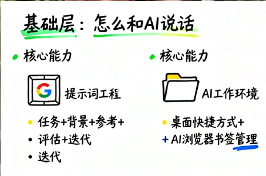
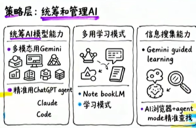

# AI应用技能

## AI应用的不同层次
2026年必须掌握的AI技能体系解析

一、基础层：与AI高效交互（持续向AI学习，教自己）

1. 提示词工程框架  
   • 核心要素：任务+背景+参考+评估+迭代  
   • 案例：撰写AI学习视频文案需明确受众（职场新人）、风格参考（口语化）、数据支撑要求  
   迭代：进行3次以上的迭代，才能保证效果；

1. AI工作环境搭建  
   • 桌面快捷管理工具、浏览器书签分类  
   • 关键认知：不同AI工具专精领域不同（如编程用Claude Code，多模态用Gemini）  

要点	具体做法
具体化	避免笼统描述，提供项目背景、核心功能、用户画像、技术偏好等。
结构化	要求模型按照特定章节、列表、表格输出，便于阅读。
角色化	让模型扮演专家（架构师、项目经理），提高专业性。
迭代化	先求大纲，再逐步深入；对不满意的部分直接指出并让其修改。
约束化	明确限定条件（时间、团队、预算、技术栈），让方案更实际。
批判性	不盲从输出，验证关键信息，结合自身经验调整。

二、应用层：AI实战能力

1. 四大核心技能  
   • Agent能力：精准执行任务（如自动修改飞书表格）  
   • APP操控：连接飞书自动回复邮件/生成会议纪要  
   • vibe Coding：无编程基础者可通过需求描述实现功能  
   • AI辅助编程：定义需求→功能描述→效果验证闭环；需要有清晰的思路

三、策略层：AI管理与优化

1. 模型统筹  
   • Gemini处理多模态任务，ChatGPT Agent模式负责精准指令  

2. 学习模式应用  
   • 使用Gemini Guided Learning分步解决问题  
   • Notebook LM提炼行业网站数据（AI浏览器+Agent精准检索），进行信息搜集

四、价值层：AI时代核心竞争力

1. 心态转型  
   • 从恐惧被取代→主动掌控AI工具  
   AI升级自己人生；

2. 不可替代优势  
   • "人味"价值：思考方式、审美判断力、经验产品化能力  
   • 方法论沉淀：将踩坑经验转化为可复用的解决方案  

总结：2026年AI竞争力差异不在于工具使用，而在于体系化能力构建（从交互框架到生态定位）和人性化价值挖掘。

## 参考书籍资料
- [AI应用技能](https://www.bilibili.com/video/BV1254y17751)