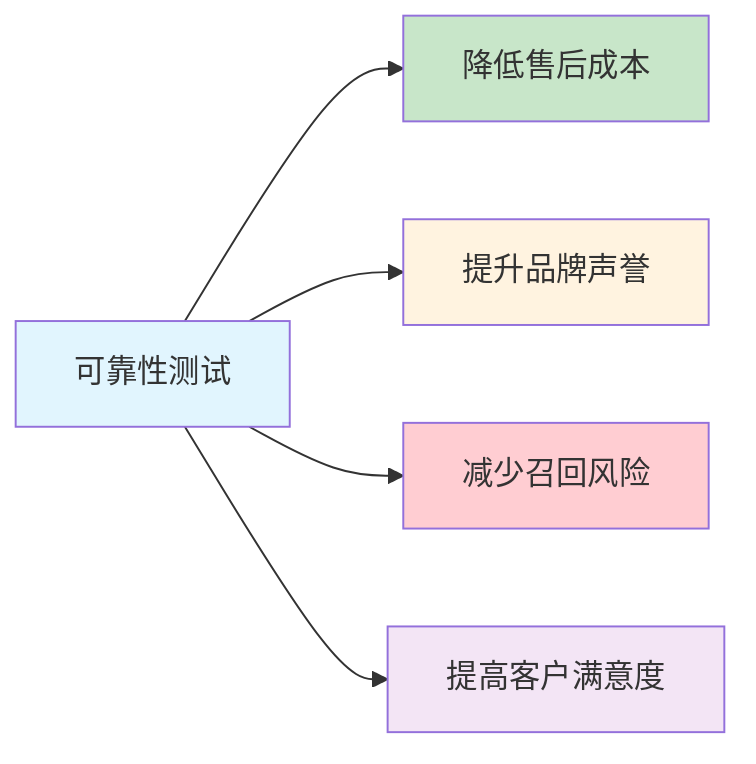
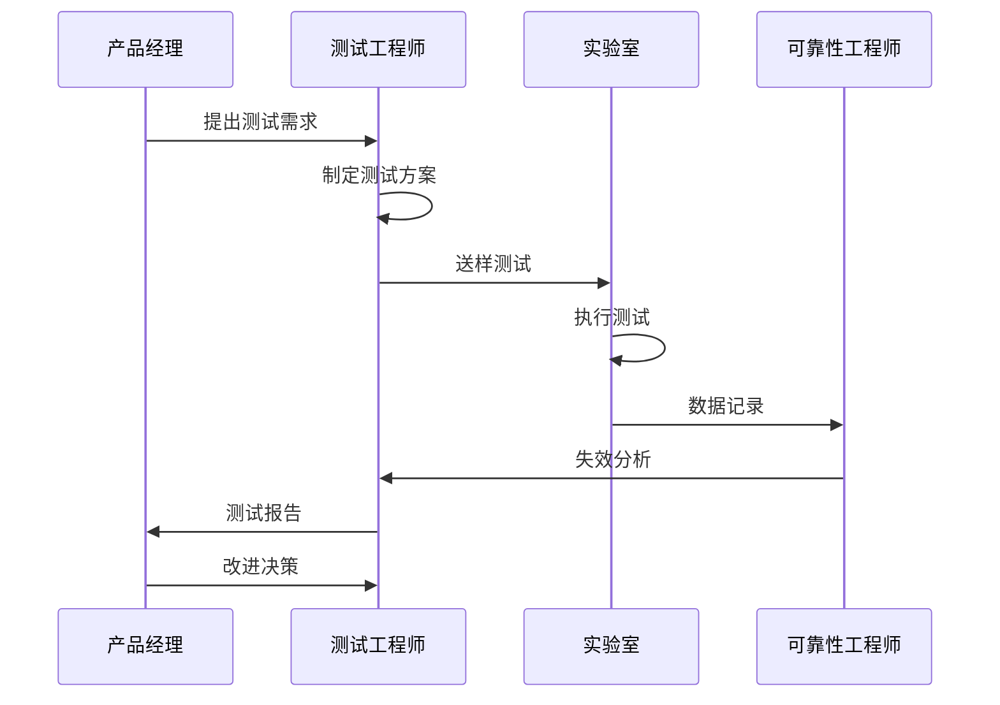

# 可靠性测试完整指南

> 可靠性测试是产品质量的生命线，确保产品在预期使用寿命内稳定运行

**三大可靠性测试**：长期温循、长期湿热、长期高温

## 一、可靠性测试概念

### 1.1 什么是可靠性测试

可靠性测试（Reliability Testing）是通过模拟产品在整个生命周期内可能遇到的各种环境应力和使用条件，评估产品在规定时间内和规定条件下完成规定功能的能力。

**核心目标：**
- 发现产品设计和制造过程中的缺陷
- 评估产品的使用寿命和失效率
- 验证产品是否满足可靠性指标要求
- 为产品改进提供数据支持

### 1.2 可靠性测试的重要性



**实际案例：**
- 某手机厂商因电池可靠性问题召回，损失超 50 亿美元
- 某汽车品牌因电子元件湿热测试不充分，导致大规模故障
- 华为产品可靠性测试标准：MTBF（平均无故障时间）> 10 万小时

## 二、三大可靠性测试详解

### 2.1 长期温循测试（Temperature Cycling）

#### 测试目的
- 评估产品在温度反复变化环境下的耐受能力
- 发现材料热膨胀系数不匹配导致的失效
- 验证焊接点、连接器的可靠性

#### 测试条件

| 参数 | 标准条件 | 严苛条件 |
|------|----------|----------|
| 高温 | +85°C | +125°C |
| 低温 | -40°C | -65°C |
| 保持时间 | 30 分钟 | 15 分钟 |
| 转换时间 | < 5 分钟 | < 2 分钟 |
| 循环次数 | 500 次 | 1000 次 |
| 升温速率 | 10°C/min | 15°C/min |

#### 测试设备
- 高低温冲击试验箱（Thermal Shock Chamber）
- 温度循环试验箱（Temperature Cycling Chamber）

#### 常见失效模式
1. **焊点疲劳开裂** - BGA、QFN 封装常见
2. **材料分层** - PCB 层间分离
3. **连接器接触不良** - 热胀冷缩导致
4. **元器件参数漂移** - 电容、电阻值变化

#### 测试标准
- **IEC 60068-2-14**：环境试验 - 温度变化试验
- **MIL-STD-883**：微电子器件试验方法
- **GB/T 2423.22**：电工电子产品环境试验

### 2.2 长期湿热测试（Damp Heat）

#### 测试目的
- 评估产品在高湿高温环境下的耐受能力
- 发现腐蚀、漏电、绝缘失效等问题
- 验证密封结构和防护涂层的有效性

#### 测试条件

| 参数 | 稳态湿热 | 交变湿热 |
|------|----------|----------|
| 温度 | 85°C | 25°C ~ 55°C |
| 湿度 | 85% RH | 90% ~ 95% RH |
| 时间 | 1000 小时 | 21 天（6 个循环） |
| 气压 | 常压 | 常压 |

#### 测试设备
- 恒温恒湿试验箱
- 盐雾试验箱（用于腐蚀测试）

#### 常见失效模式
1. **金属腐蚀** - 引脚、外壳生锈
2. **绝缘性能下降** - 漏电流增大
3. **霉菌生长** - 有机材料表面
4. **吸湿膨胀** - 塑料件变形
5. **电化学迁移** - PCB 表面离子迁移

#### 测试标准
- **IEC 60068-2-78**：湿热试验（稳态）
- **IEC 60068-2-30**：湿热试验（交变）
- **GB/T 2423.3**：电工电子产品湿热试验

### 2.3 长期高温测试（High Temperature Storage）

#### 测试目的
- 评估产品在高温储存条件下的稳定性
- 加速材料老化，预测使用寿命
- 发现高温导致的化学变化和物理变形

#### 测试条件

| 参数 | 一般条件 | 加速条件 |
|------|----------|----------|
| 温度 | 85°C | 125°C |
| 时间 | 1000 小时 | 500 小时 |
| 湿度 | < 20% RH | < 20% RH |
| 状态 | 非工作 | 非工作 |

#### 测试设备
- 高温老化试验箱
- 烘箱（Oven）

#### 常见失效模式
1. **材料老化** - 塑料变脆、橡胶硬化
2. **润滑剂挥发** - 机械部件卡滞
3. **半导体参数漂移** - 漏电流增大
4. **电池性能衰减** - 容量下降
5. **光学器件劣化** - LED 光衰

#### 测试标准
- **IEC 60068-2-2**：高温试验
- **AEC-Q100**：汽车电子应力测试认证
- **GB/T 2423.2**：电工电子产品高温试验

## 三、可靠性测试方法论

### 3.1 测试流程



### 3.2 样本量确定

**基于置信度和可靠度的样本量计算：**

$$ n = \frac{\ln(1 - C)}{\ln(R)} $$

其中：
- $n$ = 样本量
- $C$ = 置信度（通常 90% 或 95%）
- $R$ = 目标可靠度

**示例：**
- 置信度 90%，可靠度 95% → 需要 22 个样本
- 置信度 95%，可靠度 99% → 需要 299 个样本

### 3.3 失效判定标准

| 失效等级 | 描述 | 处理方式 |
|----------|------|----------|
| **致命失效** | 功能完全丧失，安全隐患 | 立即停止测试，召回 |
| **严重失效** | 主要功能失效 | 停止测试，改进设计 |
| **一般失效** | 次要功能异常 | 记录分析，评估影响 |
| **轻微失效** | 外观瑕疵，不影响功能 | 记录，可接受 |

### 3.4 数据分析方法

#### 威布尔分析（Weibull Analysis）

威布尔分布是可靠性工程中最常用的寿命分布模型：

$$ F(t) = 1 - e^{-(t/\eta)^\beta} $$

其中：
- $\eta$ = 特征寿命（尺度参数）
- $\beta$ = 形状参数（失效模式指示）

**β 值含义：**
- β < 1：早期失效期（婴儿死亡率）
- β = 1：随机失效期（使用寿命期）
- β > 1：耗损失效期（磨损老化期）

#### MTBF 计算

$$ MTBF = \frac{\text{总测试时间} \times \text{样本数量}}{\text{失效数量}} $$

## 四、可靠性测试实战

### 4.1 测试计划模板

```markdown
## 可靠性测试计划

### 产品信息
- 产品名称：XXX
- 型号：XXX
- 批次：XXX
- 样本数量：XX

### 测试项目
1. 长期温循：500 次循环（-40°C ~ +85°C）
2. 长期湿热：1000 小时（85°C/85% RH）
3. 长期高温：1000 小时（125°C）

### 测试设备
- 高低温冲击试验箱：XXX
- 恒温恒湿箱：XXX
- 高温老化箱：XXX

### 测试周期
- 开始日期：YYYY-MM-DD
- 预计完成：YYYY-MM-DD

### 判定标准
- 功能测试：100% 通过
- 外观检查：无严重缺陷
- 性能指标：在规格范围内
```

### 4.2 测试报告模板

```markdown
## 可靠性测试报告

### 测试概况
- 报告编号：REL-2026-XXX
- 测试日期：YYYY-MM-DD ~ YYYY-MM-DD
- 测试人员：XXX

### 测试结果汇总

| 测试项目 | 样本数 | 失效数 | 通过率 | 结论 |
|----------|--------|--------|--------|------|
| 温循测试 | 22 | 0 | 100% | ✅ 通过 |
| 湿热测试 | 22 | 1 | 95.5% | ⚠️ 观察 |
| 高温测试 | 22 | 0 | 100% | ✅ 通过 |

### 失效分析
**失效样品编号：** #15
**失效模式：** 湿热测试后出现腐蚀
**失效位置：** 连接器引脚
**根本原因：** 镀层厚度不足
**改进措施：** 增加镀层厚度至 5μm

### 结论与建议
- 整体可靠性满足设计要求
- 建议改进连接器防护工艺
- 建议批量生产前进行验证
```

### 4.3 常见问题分析与解决

#### 问题 1：温循测试后 BGA 焊点开裂

**原因分析：**
- PCB 与 BGA 基板 CTE（热膨胀系数）不匹配
- 焊球高度不足，应力集中

**解决方案：**
- 选择 CTE 匹配的 PCB 材料
- 增加底部填充（Underfill）
- 优化焊盘设计，增加焊球高度

#### 问题 2：湿热测试后绝缘电阻下降

**原因分析：**
- PCB 表面清洁度不足，残留离子
- 防护涂层有针孔或厚度不足

**解决方案：**
- 加强清洗工艺，控制离子污染
- 优化三防漆涂覆工艺
- 增加绝缘测试工序

#### 问题 3：高温测试后塑料件变形

**原因分析：**
- 材料耐温等级不足
- 结构设计应力集中

**解决方案：**
- 更换耐高温材料（如 PPS、PEEK）
- 优化结构设计，增加加强筋
- 增加退火工序，消除内应力

## 五、可靠性测试工具与资源

### 5.1 常用测试设备供应商

| 供应商 | 主要产品 | 官网 |
|--------|----------|------|
| ESPEC | 温湿度试验箱 | https://www.espec.co.jp |
| Thermotron | 环境试验设备 | https://www.thermotron.com |
| 重庆银河 | 国产试验箱 | https://www.yh-test.com |
| 苏试试验 | 综合试验设备 | https://www.sushi-test.com |

### 5.2 可靠性分析软件

- **JMP** - 统计分析，威布尔分析
- **Minitab** - 质量与可靠性分析
- **ReliaSoft** - 专业可靠性工程软件
- **Python + SciPy** - 开源可靠性分析

### 5.3 学习资源

**书籍推荐：**
- 《可靠性工程基础》- 杨为民
- 《电子产品可靠性设计》- 王淑芳
- 《Reliability Engineering》- Elsayed A. Elsayed

**标准文档：**
- IEC 60068 系列（环境试验）
- MIL-STD-883（军用标准）
- AEC-Q 系列（汽车电子）

## 六、总结

可靠性测试是产品质量的**最后一道防线**，需要：

1. **早期介入** - 在设计阶段就考虑可靠性
2. **充分验证** - 覆盖所有关键应力和使用场景
3. **持续改进** - 基于测试数据不断优化
4. **标准化** - 建立企业可靠性测试规范

> **记住：** 可靠性是设计出来的，不是测试出来的。但测试是验证设计、发现问题的关键手段。

---

**参考资料：**
- IEC 60068 系列标准
- 华为可靠性测试规范
- 可靠性工程师认证（CRE）知识体系

**更新时间：** 2026-03-20
**作者：** Mr.Sun
