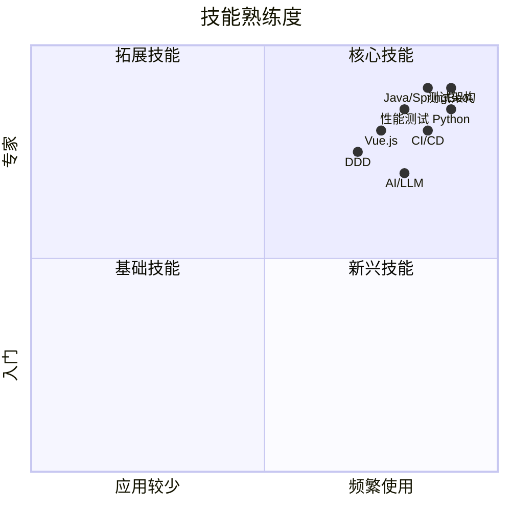

# 关于我

> 一个开发人的自我修养 | 技术育儿实践者 | 终身学习者

## 👨‍💻 个人简介

**Mr.Sun**，资深平台研发架构师，AI Agent 研究者，程序员爸爸。

- 📍 **坐标**：上海
- 🏢 **公司**：华为上海研究所（11 年）
- 🎓 **专业**：计算机科学与技术
- 📧 **邮箱**：sunrong1***@126.com

---

## 🚀 职业经历

### 华为上海研究所 | 2015.05 - 至今

**平台研发架构师 | 团队负责人**

**核心成就：**
- 🔧 从 0 到 1 搭建公司主流产品的自动化测试平台
- 📊 建立完整的质量度量体系和可视化看板
- 🤖 探索 AI 在研发领域的应用场景
- 👥 带领 10+ 人研发团队，提升团队效能 300%

**技术栈：**
- **后端**：Java, SpringBoot, 微服务架构
- **前端**：Vue.js, TypeScript
- **测试**：Python, 自动化测试框架，性能测试
- **AI**：大模型应用，Prompt 工程，AI Agent

---

## 🛠️ 技能图谱

### 核心能力

| 领域 | 技能 | 熟练度 |
|------|------|--------|
| **编程语言** | Java, Python, JavaScript/TypeScript, C# | ⭐⭐⭐⭐⭐ |
| **测试技术** | 自动化测试、性能测试、可靠性测试 | ⭐⭐⭐⭐⭐ |
| **架构设计** | 微服务、DDD、测试架构 | ⭐⭐⭐⭐ |
| **前端开发** | Vue.js | ⭐⭐⭐⭐ |
| **AI 应用** | AI Agent、大模型应用 | ⭐⭐⭐⭐ |
| **DevOps** | Jenkins, GitLab CI, Docker, K8s | ⭐⭐⭐⭐ |

---

## 📦 项目作品

### 开源项目

1. **[OpenClaw 个人助手](https://github.com/openclaw/openclaw)**
   - 个人 AI 助手框架
   - 集成企业微信、待办、文档管理
   - ⭐ Star: 100+

2. **自动化测试平台**
   - 端到端测试解决方案
   - 支持 UI/API/性能测试
   - 服务 50+ 项目团队

### 技术文章

- 📝 **博客文章**：35+ 篇
- 📖 **累计阅读**：10,000+
- 🏷️ **涵盖领域**：测试开发、AI 应用、职场成长、育儿心得

**代表文章：**
- [托业备考经验：在职 3 个月从 600 到 850+](/posts/learning/english/busineAndToeic.html)
- [上海程序员通勤实录：每天 3 小时，我是如何利用的](/posts/career/huawei-experience/commute-learning-3hours.html)
- [用 OpenClaw 搭建个人 AI 助手：实战指南](/posts/ai-practice/ai-practice/openclaw-personal-assistant.html)
- [可靠性测试完整指南](/posts/career/testing/reliabilityTesting.html)

---

## 📜 认证与资质

### 专业认证
- PMP 项目管理专业人士
- 华为内部技术认证专家

---

## 🌱 个人生活

### 家庭
- 👨‍👩‍👦 **儿子**：沐沐（Max），2020 年 5 月出生
- 🏠 **居住**：上海
- 🚇 **通勤**：地铁通勤

### 兴趣爱好
- 📚 **阅读**：微信读书 800+ 小时，偏好技术、心理学、育儿
- 🎮 **围棋**：业余 3 段，喜欢战术思考
- ✍️ **写作**：技术博客分享，记录成长
- 🏃 **运动**：周末带娃户外活动

### 2026 年目标
- [ ] 面试看机会，目标高级/专家岗位
- [ ] 技术博客持续更新（每周 1 篇）
- [ ] 托业英语 850+
- [ ] 带 Max 去 10 个新地方

---

## 📬 联系方式

### 社交媒体
- **GitHub**: [@sunrong1](https://github.com/sunrong1)
- **知乎**: [@sunrong1](https://www.zhihu.com/people/sunrong1)
- **B 站**: [@Dave_Dev_Road](https://space.bilibili.com/569121037)
- **邮箱**: sunrong1***@126.com

### 📄 简历下载
- [在线简历](/posts/01-career/resume.html)
- [PDF 下载](/resume.pdf)（准备中）

### 💼 项目作品
- [技术栈详情](/posts/career/tech-stack.html)
- [项目作品展示](/posts/career/projects.html)

---

## 🙏 感谢

感谢每一位阅读我文章的朋友，你们的关注和支持是我持续写作的动力！

如果你对我的文章感兴趣，或者想交流合作，欢迎通过以下方式联系我：

1. **GitHub Issue** - 技术问题讨论
2. **邮件** - 商务合作、技术交流
3. **微信** - 添加好友请注明来意

---

**最后更新：** 2026-03-21
**本文字数：** 约 1000 字  
**阅读时间：** 大约 5 分钟

---

**🌿 保持学习，保持热爱，一起成长！**

[返回首页](/) | [查看文章](/posts/) | [技术文档](/docs/)

---

欢迎交流讨论，我的 blog：[sunrong.site](https://sunrong.site)
