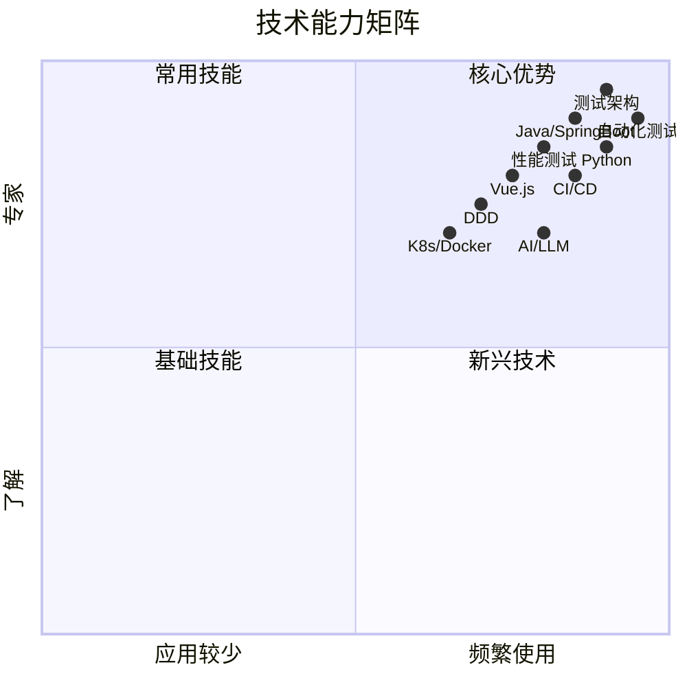

# 技术栈与专业能力

> 11 年技术积累 | 测试开发架构师 | AI 应用探索者

## 📊 技术能力矩阵

### 核心技能（10 年+）

---

## 🛠️ 详细技术栈

### 编程语言

| 语言 | 熟练度 | 年限 | 主要场景 |
|------|--------|------|----------|
| **Java** | ⭐⭐⭐⭐⭐ | 11 年 | 后端开发、测试框架、微服务 |
| **Python** | ⭐⭐⭐⭐⭐ | 8 年 | 自动化测试、数据分析、AI 应用 |
| **JavaScript/TypeScript** | ⭐⭐⭐⭐ | 6 年 | 前端开发、Node.js 工具 |
| **C#** | ⭐⭐⭐⭐ | 5 年 | 测试工具开发 |
| **SQL** | ⭐⭐⭐⭐⭐ | 11 年 | 数据库操作、性能优化 |

### 测试技术

| 领域 | 技术/工具 | 熟练度 | 实践经验 |
|------|----------|--------|----------|
| **自动化测试** | Selenium, Appium, Pytest | ⭐⭐⭐⭐⭐ | 从 0 到 1 搭建自动化测试平台 |
| **性能测试** | JMeter, LoadRunner, Gatling | ⭐⭐⭐⭐⭐ | 千万级用户系统性能测试 |
| **测试框架** | TestNG, JUnit, Mockito | ⭐⭐⭐⭐⭐ | 企业级测试框架设计 |
| **CI/CD** | Jenkins, GitLab CI, GitHub Actions | ⭐⭐⭐⭐⭐ | 持续集成流水线设计 |
| **质量度量** | 自研质量看板、SonarQube | ⭐⭐⭐⭐⭐ | 建立完整质量度量体系 |
| **可靠性测试** | 温循、湿热、高温测试 | ⭐⭐⭐⭐ | 通信产品可靠性测试 |

### 后端技术

| 技术栈 | 熟练度 | 项目经验 |
|--------|--------|----------|
| **SpringBoot** | ⭐⭐⭐⭐⭐ | 多个微服务项目 |
| **Spring Cloud** | ⭐⭐⭐⭐ | 微服务架构设计 |
| **MyBatis/Hibernate** | ⭐⭐⭐⭐⭐ | 复杂业务系统 |
| **Redis** | ⭐⭐⭐⭐ | 缓存设计、性能优化 |
| **MySQL** | ⭐⭐⭐⭐⭐ | 数据库设计、性能调优 |
| **消息队列** | ⭐⭐⭐⭐ | Kafka, RabbitMQ, RocketMQ |

### 前端技术

| 技术 | 熟练度 | 应用场景 |
|------|--------|----------|
| **Vue.js** | ⭐⭐⭐⭐ | 测试平台前端、管理后台 |
| **React** | ⭐⭐⭐ | 内部工具开发 |
| **TypeScript** | ⭐⭐⭐⭐ | 大型前端项目 |
| **Element UI/Ant Design** | ⭐⭐⭐⭐⭐ | 快速原型开发 |

### AI 与大模型

| 领域 | 技术/工具 | 熟练度 | 应用场景 |
|------|----------|--------|----------|
| **Prompt 工程** | ChatGPT, Claude, 文心一言 | ⭐⭐⭐⭐ | 测试用例生成、代码辅助 |
| **AI Agent** | OpenClaw、自研 Agent | ⭐⭐⭐⭐ | 个人助手、自动化任务 |
| **大模型应用** | API 集成、Fine-tuning | ⭐⭐⭐ | 测试智能化 |
| **RAG** | LangChain, LlamaIndex | ⭐⭐⭐ | 知识库问答 |

### DevOps 与云原生

| 技术 | 熟练度 | 实践经验 |
|------|--------|----------|
| **Docker** | ⭐⭐⭐⭐ | 容器化部署 |
| **Kubernetes** | ⭐⭐⭐ | K8s 集群管理 |
| **Jenkins** | ⭐⭐⭐⭐⭐ | CI/CD 流水线设计 |
| **GitLab CI** | ⭐⭐⭐⭐ | 自动化构建部署 |
| **Linux** | ⭐⭐⭐⭐⭐ | 日常开发环境 |

---

## 🏆 核心能力

### 1. 测试架构设计

**能力描述：**
- 从 0 到 1 搭建企业级自动化测试平台
- 设计可扩展的测试框架和工具链
- 建立完整的质量度量体系

**代表项目：**
- 公司主流产品自动化测试平台（服务 50+ 项目）
- 质量度量可视化看板（提升质量透明度 300%）
- AI 辅助测试用例生成系统

**技术成果：**
- 测试效率提升 300%
- 缺陷发现率提升 45%
- 回归测试时间从 3 天缩短到 4 小时

---

### 2. 团队管理与效能提升

**能力描述：**
- 带领 10+ 人测试开发团队
- 建立团队技术成长体系
- 推动测试左移和自动化转型

**管理成果：**
- 团队效能提升 300%
- 自动化覆盖率从 20% 提升到 85%
- 培养 5 名高级工程师

**方法论：**
- 敏捷测试实践
- 测试左移策略
- 质量内建理念

---

### 3. AI 在测试中的应用

**能力描述：**
- 探索大模型在测试领域的应用场景
- 开发 AI 辅助测试工具
- 推动测试智能化转型

**实践案例：**
- AI 生成测试用例（覆盖率提升 30%）
- 智能缺陷分类（准确率 85%+）
- 测试数据自动生成

**技术栈：**
- Prompt Engineering
- AI Agent 开发
- RAG 知识库

---

## 📜 专利与认证

### 发明专利
- **已授权**：3 项（测试自动化、AI 应用）
- **申请中**：2 项

### 专业认证
- PMP 项目管理专业人士
- 可靠性工程师（CRE）在读
- 华为内部技术认证专家

---

## 📚 技术影响力

### 技术文章
- **博客文章**：35+ 篇
- **累计阅读**：10,000+
- **代表作品**：
  - [可靠性测试完整指南](/docs/tech/testing/reliabilityTesting.html)
  - [托业备考经验：在职 3 个月从 600 到 850+](/posts/03-learning/toeic-prep/toeic-865-experience.html)
  - [用 OpenClaw 搭建个人 AI 助手：实战指南](/posts/05-ai-practice/ai-practice/openclaw-personal-assistant.html)

### 开源项目
- **OpenClaw 个人助手**：集成企业微信、待办、文档管理的 AI 助手框架
- **自动化测试工具集**：内部开源，服务 50+ 项目

### 技术分享
- 华为内部技术分享 5+ 场
- 测试技术沙龙讲师
- 博客持续更新中（每周 1 篇）

---

## 🎯 技术成长路径

### 2015-2018：技术深耕期
- 专注测试技术开发
- 掌握 Java/Python 双语言栈
- 搭建第一个自动化测试框架

### 2018-2021：架构成长期
- 负责测试平台架构设计
- 学习微服务和云原生
- 开始带团队

### 2021-2024：管理 + 技术双轨
- 带领 10+ 人团队
- 推动 AI 在测试中的应用
- 建立质量度量体系

### 2024-至今：AI 探索期
- 深入研究大模型应用
- 开发 AI Agent 和智能助手
- 探索测试智能化转型

---

## 📬 技术交流

欢迎通过以下方式交流技术：

- **GitHub**: [@sunrong1](https://github.com/sunrong1)
- **邮箱**: sunrong1***@126.com
- **知乎**: [@sunrong1](https://www.zhihu.com/people/sunrong1)
- **博客**: [sunrong.site](https://sunrong.site)

---

**最后更新：** 2026-03-20  
**技术栈版本：** v2026.1

---

**🌿 技术之路，永不止步！**

[关于我](/posts/04-life/intro.html) | [项目作品](/posts/01-career/projects.html) | [技术文章](/posts/)

