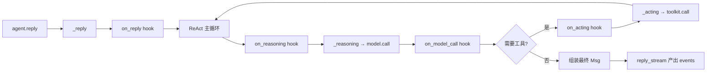
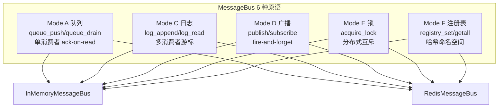
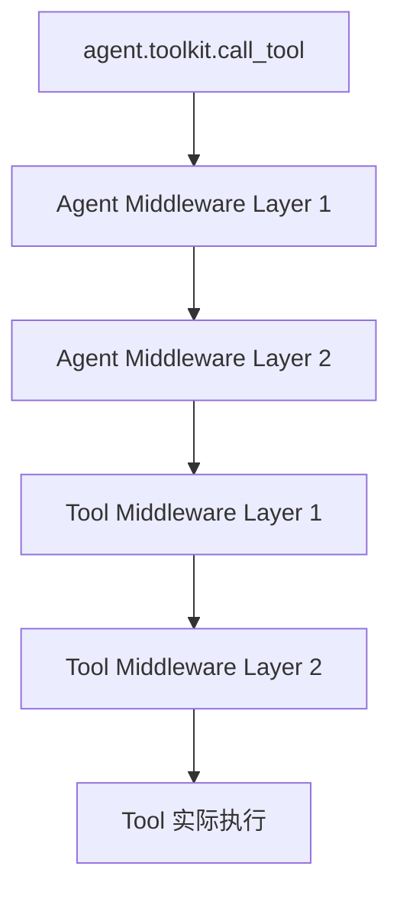

# AgentScope 2.0 学习系列 W1：架构全景 + 核心类图

> **系列**：[8 周成为 Agent 应用架构师](https://github.com/sunrong1/agentscope/blob/learning-journal/LEARNING.md) · Week 1
> **周期**：2026-07-18 → 2026-09-12
> **学习对象**：[AgentScope 2.0](https://github.com/agentscope-ai/agentscope)（阿里达摩院出品的多智能体框架）
> **完整承诺**：[LEARNING.md](https://github.com/sunrong1/agentscope/blob/learning-journal/LEARNING.md)
> **学习记录**：[sunrong1/agentscope · learning-journal 分支](https://github.com/sunrong1/agentscope/tree/learning-journal)
> **TL;DR**：单一 Agent 类 + Middleware 钩子链 + MessageBus 6 原语 = AgentScope 2.0 的核心设计哲学。

<!-- more -->

## 一、为什么是 AgentScope

我此前在项目中零散用过 AgentScope 的若干 API，但**会用**和**能设计**是两件事。

5 月底 Vibe Coding 项目（[塔防游戏](https://sunrong.site/posts/ai-practice/vibe-coding-plantsgame.html)）用到了很多 Agent 概念，但对框架本身的内部架构一直停留在"黑盒"状态。**这次下定决心：8 周把它拆明白。**

## 二、公开承诺（不给自己退路）

> 完整版本在 [`LEARNING.md`](https://github.com/sunrong1/agentscope/blob/learning-journal/LEARNING.md)，这里只列骨架。

- **目标**：4 个可验证能力——拆解、扩展、排错、评判
- **方法**：3 阶段（宏观认知 / 核心深潜 / 实战）+ 周自检
- **失败惩罚**：仓库 archived + 请朋友圈喝咖啡

**立 flag 的意义，不在 flag 立得多漂亮，在于有人看见、你不能悄悄撤掉。**

## 三、本周交付物

| 天 | 任务 | 产出 | 链接 |
|---|---|---|---|
| D1 | Clone + 建分支 | `learning-journal` 分支 | [commit](https://github.com/sunrong1/agentscope/commit/40d9bb6) |
| D2 | 架构全景图 | 4 层 + 6 图 | [architecture.md](https://github.com/sunrong1/agentscope/blob/learning-journal/notes/phase-1/architecture.md) |
| D3 | 核心类图 | 4 大类族 | [class-diagrams.md](https://github.com/sunrong1/agentscope/blob/learning-journal/notes/phase-1/class-diagrams.md) |
| D7 | 公开承诺 | LEARNING.md | [LEARNING.md](https://github.com/sunrong1/agentscope/blob/learning-journal/LEARNING.md) |

W1 还有 D4-D6 没交付（时序图、分布式拓扑、ADR 评判），这周内补完。

## 四、发现 1：单一 Agent 类 + Middleware 钩子链

跟 LangChain、AutoGen 的"按子类拆分 Agent"（ReActAgent / PlanAgent / ...）路线不同，**AgentScope 2.0 走的是反方向**：

**一个 `Agent` 类，所有行为差异通过 6 个 Middleware 钩子组合实现。**



**6 个 Middleware 钩子**（`src/agentscope/agent/_agent.py:155-170`）：

| 钩子 | 触发时机 | 典型用途 |
|---|---|---|
| `on_reply` | 整个 reply 入口/出口 | 限流、计时 |
| `on_reasoning` | 模型推理前后 | 输出改写、guardrails |
| `on_acting` | 工具调用前后 | 工具白名单、脱敏 |
| `on_model_call` | 实际调用 model | 成本统计、fallback |
| `on_system_prompt` | 拼装 system prompt | 动态注入上下文 |
| `on_compress_context` | 上下文压缩 | 自定义压缩策略 |

**为什么这个设计是"对的"**：

- ✅ **加新能力 = 写一个 Middleware**，不用碰 Agent 主类
- ✅ **用户行为 = 基础 Agent + 一组 Middleware 链**，可组合
- ⚠️ **风险**：Middleware 多了形成"隐式调用图"——这就是为什么 `tracing` 本身**必须**是 Middleware

**这是我看完 `_agent.py` 2911 行后最意外的发现**——以为会有十几个 Agent 子类，结果就一个。

## 五、发现 2：MessageBus 的 6 种原语抽象

`_base.py` 顶部那段注释几乎是教科书级——**把原语按"消费语义"分，而不是按业务场景分**：



**6 原语对应业务**（命名约定）：

| 模式 | 业务 | 关键 API |
|---|---|---|
| A 队列 | Session inbox、跨进程任务 | `queue_push` / `queue_drain` |
| C 日志 | Session 事件流（可重放）| `log_append` / `log_read` |
| D 广播 | 唤醒信号、取消 | `publish` / `subscribe` |
| E 锁 | Session 互斥 | `acquire_lock` / `is_locked` |
| F 注册表 | 后台任务注册 | `registry_set` / `registry_getall` |

**关键决策**：`MessageBus` **故意不暴露"广播到 N 个消费者"原语**。需要 fan-out 就在 producer 端用 Mode A 给 N 个收件箱各推一份。理由：Redis Streams 的 XREADGROUP 协调代价大，让 producer 负责去重，bus 接口保持简单。

**架构师视角**：

- ✅ Storage（持久化）和 MessageBus（实时传输）是**正交的两层**，可独立选型
- ✅ 单测用 InMemory，生产用 Redis，业务代码完全透明
- ✅ 6 原语覆盖 90% 场景，多一种都是 over-engineering

## 六、发现 3：Tool 也有自己的 Middleware（双层洋葱）

这是我前两天没注意到的细节——`ToolBase` 居然有自己的一套 `ToolMiddlewareBase`：



**两层洋葱**：
- 外层（Agent Middleware）：拦截整个 reply、reasoning、acting
- 内层（Tool Middleware）：拦截单个 tool 的输入输出

`ToolMiddlewareBase` 的 `on_tool_call` 签名有意思：

```python
async def on_tool_call(
    self,
    tool: "ToolBase",
    input_kwargs: dict[str, Any],
    next_handler: Callable[..., AsyncGenerator[ToolChunk, None]],
) -> AsyncGenerator[ToolChunk, None]:
    ...
```

`next_handler` **永远**返回 async generator，所以 middleware **不需要知道**底层是流式还是非流式。这个设计太优雅了。

## 七、一句话架构评判

**优点**：

- 单一 Agent 类 + Middleware = 极高扩展性
- MessageBus 6 原语抽象干净
- Adapter 层完全独立，换供应商不影响业务
- FastAPI 装配式注入，云原生友好

**局限**：

- 中间件多后调用链不直观（必须有 Tracing）
- 单一 Agent 类对"非 ReAct 推理模式"（如 MapReduce、Hierarchical Planning）支持需自查
- Workspace 沙箱支持 5 种后端（docker/k8s/e2b/daytona/opensandbox），运维复杂度高

## 八、下周计划（W2）

- [ ] 补完 W1-D4 时序图（agent.reply 完整时序 + tool call 完整时序）
- [ ] W1-D5 分布式部署拓扑
- [ ] W1-D6 ADR 架构评判（3 个关键决策的 trade-off）
- [ ] W2 周自检 + 收尾 Phase 1
- [ ] 进入 Phase 2-W3：精读 `_agent.py` 2911 行，写源码注解

## 九、资源链接

- 📂 学习仓库：[sunrong1/agentscope · learning-journal](https://github.com/sunrong1/agentscope/tree/learning-journal)
- 📋 公开承诺：[LEARNING.md](https://github.com/sunrong1/agentscope/blob/learning-journal/LEARNING.md)
- 📐 本周架构图：[architecture.md](https://github.com/sunrong1/agentscope/blob/learning-journal/notes/phase-1/architecture.md)
- 🧬 本周类图：[class-diagrams.md](https://github.com/sunrong1/agentscope/blob/learning-journal/notes/phase-1/class-diagrams.md)
- 🏛️ 官方仓库：[agentscope-ai/agentscope](https://github.com/agentscope-ai/agentscope)
- 📖 官方文档：[docs.agentscope.io](https://docs.agentscope.io/)

***
> 觉得有用？欢迎在 [issue](https://github.com/sunrong1/agentscope/issues) 留言。
> 想一起学 AgentScope 8 周？留言，咱互相监督。
>
> —— Mr.Sun, 2026-07-18

***
## 📚 AgentScope 8 周学习系列

- 🎯 **本篇：W1 架构全景 + 核心类图**（你正在读）
- 🔧 **[配套工具：SM-2 复习系统](https://sunrong.site/posts/ai-practice/ai-app/sm2-review-system.html)** — 420 行 Python 的自适应复习
- 📝 **[W2：真学习复盘](https://sunrong.site/posts/ai-practice/ai-app/agentscope-w2-real-learning.html)** — 从伪产出到真读代码 5 天记录

**完整承诺**：[LEARNING.md](https://github.com/sunrong1/agentscope/blob/learning-journal/LEARNING.md) · 持续更新到 9-12
