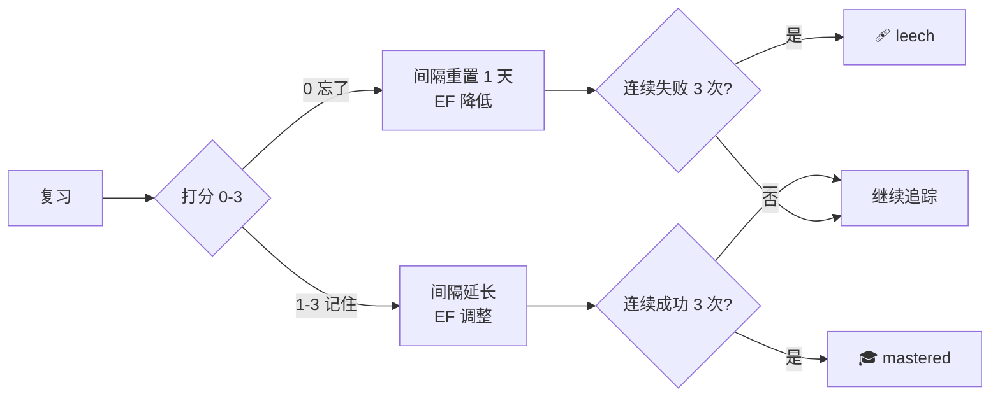
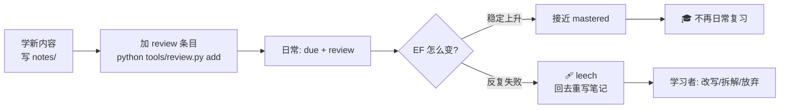

# 我用 420 行 Python 给自己写了一个 SM-2 复习系统

> 起因：我刚立了 [8 周成为 Agent 应用架构师](https://sunrong.site/posts/ai-practice/agentscope-w1-architecture.html) 的 flag，写了 5 份长文档。但学完不代表记住——人类的遗忘曲线决定了 **24 小时后我会忘掉 70%**。所以我用 SM-2 算法（Anki 底层算法）给自己写了一个复习系统。
>
> **TL;DR**：一个 420 行的 Python 脚本，零外部依赖，6 个 CLI 命令，基于 SM-2 算法自适应调整复习间隔。代码在 [github.com/sunrong1/agentscope](https://github.com/sunrong1/agentscope/tree/learning-journal) 的 `tools/review.py`。

<!-- more -->

## 一、为什么不用现成的 Anki

**Anki 很好，但它有 3 个我受不了的问题**：

1. **填卡片的成本比学还高**——尤其是技术文档，一篇 5000 字的笔记，要切成 20 张卡，每张还要手写 question/back
2. **不透明**——我看不到"我现在的记忆状态是什么样的"
3. **跨设备 + 同步**——要么买 AnkiDroid 的同步服务，要么自己折腾自建 AnkiWeb

**我的需求**很简单：
- 追踪我学了什么（自动记录）
- 告诉我今天该复习啥（按算法算）
- 复习完打 1 个分（0-3），下次自动调整
- 数据可读、可迁移、能 git 跟踪

**所以我自己写了**。

## 二、核心设计：SM-2 算法

艾宾浩斯曲线大家应该都听过：遗忘速度是先快后慢。但**具体怎么排复习间隔**，不同算法给出了不同答案。

**SM-2** 是 1987 年 SuperMemo 提出的算法，是 Anki 1.x 的底层核心。核心思想：



**每个条目维护 3 个核心数字**：
- **EF**（Easiness Factor，难度系数）—— 初始 2.5，最低 1.3
- **interval**（当前间隔，天）—— 1 → 6 → 14 → 30+ 渐进
- **reps**（连续成功次数）—— 失败时归零

**每次复习后**：
- 间隔 = 上次间隔 × EF（成功时）
- EF = max(1.3, EF + Δ)，Δ 由打分决定

**这是真自适应**——不是写死 7-14-30，而是根据你的实际表现动态调。

## 三、420 行代码长什么样

整个系统是一个文件 `tools/review.py`，6 个命令，零外部依赖（只用 Python 标准库）。

### 核心算法（节选）

```python
def sm2_update(ef, interval, reps, score):
    """SM-2 算法核心。"""
    q = SCORE_TO_QUALITY[score]  # 0-3 → 0-5

    # 1) 更新 EF（对所有打分都生效）
    new_ef = ef + (0.1 - (5 - q) * (0.08 + (5 - q) * 0.02))
    new_ef = max(1.3, new_ef)

    # 2) 决定 interval 和 reps
    if q < 3:
        new_reps = 0      # 失败：重置
        new_interval = 1
    else:
        new_reps = reps + 1
        if new_reps == 1:   new_interval = 1
        elif new_reps == 2: new_interval = 6
        else:               new_interval = round(interval * new_ef)

    return new_ef, new_interval, new_reps
```

### CLI 接口

```bash
# 1. 加条目（关联笔记）
python tools/review.py add \
    --id phase1-architecture \
    --title "Phase 1 架构全景（4 层 + 6 大原语）" \
    --file notes/phase-1/architecture.md \
    --difficulty 2

# 2. 看今天要复习啥
python tools/review.py due

# 3. 复习（交互式打分 0-3）
python tools/review.py review phase1-architecture

# 4. 看统计
python tools/review.py stats
```

## 四、我的实战追踪

刚才 W1 写的 5 份文档 + 1 篇博客，全部登记进了系统：

```bash
$ python tools/review.py list
ID                        标题                              到期        EF    复习
--------------------------------------------------------------------------------
learning-commitment       公开承诺（LEARNING.md）            ⚠️ 今天    2.50  0
phase1-architecture       Phase 1 架构全景（4 层 + 6 大原语）  ⚠️ 今天    2.50  0
phase1-classes            Phase 1 核心类图（4 大类族）        ⚠️ 今天    2.50  0
phase1-distributed        Phase 1 分布式拓扑（10 图）        ⚠️ 今天    2.50  0
phase1-sequences          Phase 1 时序图（6 套核心调用）      ⚠️ 今天    2.50  0
w1-blog                   W1 博客总结                       ⚠️ 今天    2.50  0
```

**全部 due（因为刚加，interval=0）**。我接下来会逐个 review，给自己打分。

**预计 30 分钟能跑完 6 个**。

## 五、关键设计决策（为什么这么做）

### 决策 1：显式 review 命令，不用文件 mtime

**原始设计**：通过文件修改时间自动识别复习行为。

**我拒绝的原因**：
- 改个 typo、修个错别字 → 系统以为你复习了
- 多人协作 → mtime 不可信
- "我在脑子里复习" → 完全不触发

**我的方案**：必须主动 `python tools/review.py review <id>`。**显式优于隐式**。

### 决策 2：打分 0-3，不用 0-5

**SM-2 标准用 0-5**，但我嫌细。**0-3 更符合直觉**：

| 分 | 含义 | 映射 SM-2 q |
|---|---|---|
| 0 | 忘了 | 1 |
| 1 | 吃力 | 3 |
| 2 | 还可以 | 4 |
| 3 | 秒答 | 5 |

### 决策 3：Leach 检测（连续失败 3 次 → 🩹）

如果一个内容你复习 5 次都记不住，**算法不会帮你**。我加了 leech 机制：**连续失败 3 次自动标记**。你可以选择：
- 重写笔记（结构化、加图）
- 拆成更小的卡片
- 干脆放弃（移到 "abandoned" 列表）

### 决策 4：毕业机制（连续成功 3 次 + EF≥2.5 → 🎓）

不是所有内容都要永久复习。**3 次成功 + 较高的 EF = 真的掌握了**。标记为 `mastered` 后：
- 不再出现在 `due` 命令里
- 但 `stats` 还能看到
- `review <id> --force` 还能复习（防遗忘）

### 决策 5：零依赖

不引 `rich` / `typer` / `pydantic`——**只用 Python 标准库**。理由：
- 任何 Python 3.8+ 都能跑
- 启动快（< 50ms）
- 代码可读（不藏抽象）

## 六、跟 AgentScope 学习系统怎么联动

我现在的学习闭环是：



**重点**：**leech 标记 = "我没掌握" 的硬数据**。这比"我感觉我懂了"靠谱 100 倍。

## 七、P2 路线图（什么时候做）

- [ ] **Anki 卡片导出**——给喜欢 Anki 的人用
- [ ] **Cloze 卡片**——一个内容生成多张卡（`{{c1::关键概念}}`）
- [ ] **难度自动调整**——基于连续表现自动升降级
- [ ] **Web UI**——浏览器里看进度
- [ ] **主题/tags**——按 AgentScope 模块分类
- [ ] **导出 PDF 报告**——周报 / 月报可视化

**但 P0 + P1 已经能跑了**。先把学习闭环跑起来，再加花活。

## 八、给想用的人

### 最小上手（3 分钟）

```bash
# 1. clone 仓库
git clone https://github.com/sunrong1/agentscope.git
cd agentscope
git checkout learning-journal

# 2. 添加你想追踪的第一个内容
python tools/review.py add \
    --id my-first-item \
    --title "我的第一个复习条目" \
    --file "你的笔记路径" \
    --difficulty 2

# 3. 明天 review
python tools/review.py due
python tools/review.py review my-first-item
```

### 迁移到其他场景

这个工具的**所有"领域知识"都参数化了**：

```python
# 改这一行就能切到背单词
DATA_FILE = Path("words/review_data.json")

# 改 add 命令的 --difficulty 提示
# 改 SCORE_TO_QUALITY 映射
# 改 REVIEW_INTERVALS 初始间隔（如果你不想用 SM-2 严格规则）
```

## 九、资源

- 📂 **完整代码**：[github.com/sunrong1/agentscope · tools/review.py](https://github.com/sunrong1/agentscope/blob/learning-journal/tools/review.py)
- 📖 **使用文档**：[tools/README.md](https://github.com/sunrong1/agentscope/blob/learning-journal/tools/README.md)
- 🎯 **W1 学习总结**：[W1: AgentScope 架构全景 + 核心类图](https://sunrong.site/posts/ai-practice/ai-app/agentscope-w1-architecture.html)
- 📋 **公开承诺**：[LEARNING.md](https://github.com/sunrong1/agentscope/blob/learning-journal/LEARNING.md)
- 🧠 **SM-2 原始论文**：P.A. Wozniak, *Optimization of repetition spacing in the practice of learning* (1990)

***
> **写在最后**
>
> "学"和"记住"是两件事。学完不复习 = 24 小时后忘掉 70%。
>
> 复习系统不是负担，是**把短期记忆写进长期记忆的物理动作**。
>
> 跟学习 AgentScope 一样，**与其焦虑，不如动手**。420 行代码 = 一个能跑一辈子的复习工具。
>
> —— Mr.Sun, 2026-07-19

***
## 📚 AgentScope 8 周学习系列

- 🎯 **[W1：架构全景 + 核心类图](https://sunrong.site/posts/ai-practice/ai-app/agentscope-w1-architecture.html)** — 单一 Agent 类 + 6 原语 MessageBus + 双层洋葱
- 📝 [W2：真学习复盘](https://sunrong.site/posts/ai-practice/ai-app/agentscope-w2-real-learning.html) — 从伪产出到真读代码 5 天记录
- 🔧 本篇：SM-2 复习系统（配套工具）

**完整承诺**：[LEARNING.md](https://github.com/sunrong1/agentscope/blob/learning-journal/LEARNING.md) · 持续更新到 9-12
