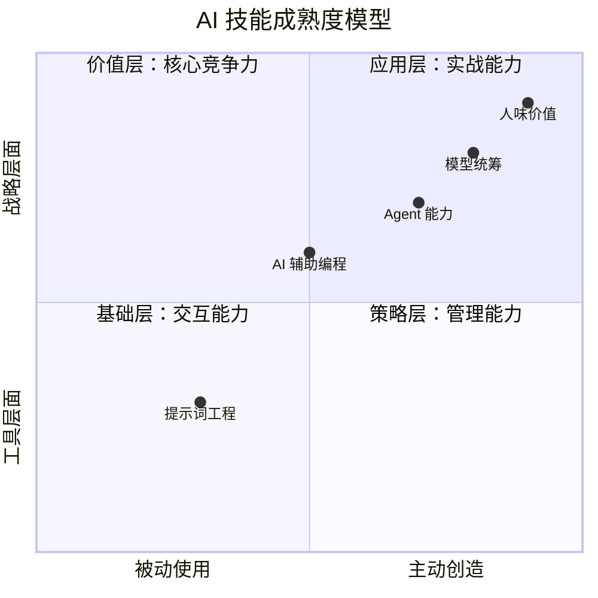
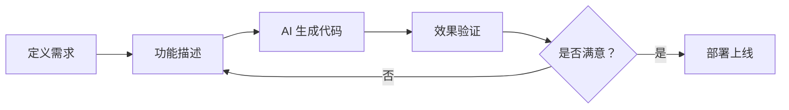

# AI 应用技能

> 2026 年必须掌握的 AI 技能体系解析

---

## 📊 AI 应用的不同层次

2026 年，AI 竞争力差异不在于工具使用，而在于**体系化能力构建**（从交互框架到生态定位）和**人性化价值挖掘**。



---

## 一、基础层：与 AI 高效交互

### 1. 提示词工程框架

**核心要素：任务 + 背景 + 参考 + 评估 + 迭代**

#### 案例：撰写 AI 学习视频文案

```markdown
# 差的提示词
"帮我写一个 AI 学习视频文案"

# 好的提示词
"你是一位资深技术教育专家，请为职场新人撰写一个 10 分钟的 AI 学习视频文案。
要求：
- 风格：口语化、轻松有趣
- 结构：开场（30 秒）+ 痛点（2 分钟）+ 方法（5 分钟）+ 行动呼吁（2 分钟）
- 数据支撑：引用 2024-2025 年 AI 应用数据
- 案例：包含 2-3 个真实职场应用场景
- 受众：25-35 岁互联网从业者，无 AI 基础"
```

**关键认知：** 进行 3 次以上的迭代，才能保证效果。

#### 提示词优化六原则

| 原则 | 具体做法 | 示例 |
|------|----------|------|
| **具体化** | 避免笼统描述，提供项目背景、核心功能、用户画像、技术偏好等 | ❌ "写个方案" → ✅ "为电商 APP 写个用户增长方案，目标 3 个月 DAU 提升 30%" |
| **结构化** | 要求模型按照特定章节、列表、表格输出，便于阅读 | "请按以下结构输出：1.背景分析 2.目标设定 3.实施步骤 4.风险评估" |
| **角色化** | 让模型扮演专家（架构师、项目经理），提高专业性 | "你是一位有 10 年经验的测试架构师，请评估这个自动化测试方案" |
| **迭代化** | 先求大纲，再逐步深入；对不满意的部分直接指出并让其修改 | "先给我大纲" → "第二部分展开" → "这个案例不够好，换一个" |
| **约束化** | 明确限定条件（时间、团队、预算、技术栈），让方案更实际 | "团队 5 人，预算 50 万，3 个月内上线，使用 Java 技术栈" |
| **批判性** | 不盲从输出，验证关键信息，结合自身经验调整 | "这个数据源是什么？" "这个方案在 XX 场景下可能有问题" |

---

### 2. AI 工作环境搭建

#### 桌面快捷管理工具

- **浏览器书签分类**：按场景分类（编程/写作/设计/数据分析）
- **快捷启动器**：Raycast/Alfred，一键唤起常用 AI 工具
- **剪贴板管理**：PasteQube，快速复用提示词模板

#### 关键认知：不同 AI 工具专精领域不同

| 任务类型 | 推荐工具 | 理由 |
|----------|----------|------|
| **编程开发** | Claude Code、Cursor | 代码理解能力强，支持多文件编辑 |
| **多模态任务** | Gemini 2.5 Pro | 图像 + 文本联合分析，支持长视频理解 |
| **长文档处理** | Notebook LM、Claude | 支持 100K+ tokens 上下文 |
| **精准指令** | ChatGPT Agent 模式 | 任务执行准确，支持工具调用 |
| **信息搜集** | Perplexity、秘塔搜索 | 实时联网，提供引用来源 |
| **创意写作** | Claude、Jasper | 文风自然，适合长文创作 |

---

## 二、应用层：AI 实战能力

### 1. 四大核心技能

#### 🔹 Agent 能力：精准执行任务

**能力要求：**
- 能清晰定义任务目标和成功标准
- 会拆解复杂任务为可执行步骤
- 理解 Agent 的能力边界和限制

**案例：自动修改飞书表格**
```
任务：更新项目进度表
步骤：
1. 读取飞书多维表格中的项目数据
2. 对比实际进度和计划进度
3. 标记延期项目（红色）
4. 发送提醒给项目负责人
```

#### 🔹 APP 操控：连接工作流

**典型场景：**
- 自动回复邮件（Gmail + AI）
- 生成会议纪要（飞书妙记 + AI 总结）
- 自动整理日报（Git 提交记录 + AI 生成）

#### 🔹 Vibe Coding：无代码实现功能

**核心理念：** 用自然语言描述需求，让 AI 生成代码

**工具推荐：**
- **v0.dev**：生成 React 组件
- **Bolt.new**：全栈应用生成
- **Lovable**：从设计图到代码

**案例：**
```
需求描述：
"创建一个待办事项管理页面，要求：
- 左侧是分类列表（工作/生活/学习）
- 右侧是任务卡片，支持拖拽
- 顶部有搜索框和筛选器
- 使用 Tailwind CSS 样式"
```

#### 🔹 AI 辅助编程：需求→功能→验证闭环

**工作流程：**


**关键能力：** 需要有清晰的思路，能准确描述问题和期望结果。

---

## 三、策略层：AI 管理与优化

### 1. 模型统筹

**核心原则：** 根据任务特点选择合适的模型

| 模型 | 擅长场景 | 使用建议 |
|------|----------|----------|
| **Gemini 2.5 Pro** | 多模态、长视频、复杂推理 | 上传 PDF/图片/视频让 AI 分析 |
| **Claude 3.7 Sonnet** | 长文档、代码、创意写作 | 处理 100K+ tokens 文档 |
| **ChatGPT-4o** | 精准指令、工具调用 | Agent 模式执行具体任务 |
| **DeepSeek** | 中文场景、性价比高 | 日常对话、快速查询 |

### 2. 学习模式应用

#### Gemini Guided Learning

**适用场景：** 分步解决复杂问题

**示例：**
```
"我想学习微服务架构，请：
1. 先评估我的当前水平（问我 5 个问题）
2. 根据我的回答制定学习计划
3. 每个知识点讲解后出 3 道练习题
4. 根据我的答题情况调整难度"
```

#### Notebook LM 信息提炼

**工作流：**
```
行业网站数据 → Notebook LM 导入 → AI 提炼要点 → 生成洞察报告
```

**案例：** 竞品分析
- 导入 10 个竞品官网
- 让 AI 提取产品特性、定价策略、目标用户
- 生成对比表格和 SWOT 分析

---

## 四、价值层：AI 时代核心竞争力

### 1. 心态转型

```
❌ 恐惧被取代
   ↓
✅ 主动掌控 AI 工具
   ↓
🚀 AI 升级自己人生
```

**转变要点：**
- 从"AI 会不会取代我"到"我如何用 AI 提升 10 倍效率"
- 从"学习所有工具"到"建立自己的 AI 工作流"
- 从"被动接受输出"到"主动引导和批判"

### 2. 不可替代优势

#### 🎯 "人味"价值

| AI 擅长 | 人类擅长 |
|---------|----------|
| 数据处理 | 审美判断 |
| 模式识别 | 情感共鸣 |
| 快速生成 | 深度思考 |
| 知识检索 | 经验直觉 |

**核心竞争力：** 思考方式、审美判断力、经验产品化能力

#### 📚 方法论沉淀

**将踩坑经验转化为可复用的解决方案：**

```
个人经验 → 结构化总结 → 模板/工具 → 分享传播
   ↓
建立个人品牌 → 提升行业影响力
```

**案例：**
- 测试自动化踩坑 100 次 → 《自动化测试避坑指南》
- AI 提示词迭代 500 次 → 《提示词工程实战手册》

---

## 📈 AI 技能成长路线

### 初级（1-3 个月）
- ✅ 掌握提示词六原则
- ✅ 熟悉 3-5 个核心 AI 工具
- ✅ 能在日常工作中使用 AI 提效

### 中级（3-12 个月）
- ✅ 建立个人 AI 工作流
- ✅ 能使用 Agent 完成复杂任务
- ✅ 开始沉淀方法论

### 高级（1-2 年）
- ✅ 形成 AI 战略思维
- ✅ 能设计 AI 驱动的产品/服务
- ✅ 建立个人品牌和影响力

---

## 📚 参考资源

### 视频课程
- [AI 应用技能](https://www.bilibili.com/video/BV1254y17751) - B 站

### 推荐书籍
- 《提示词工程实战》
- 《AI 时代的学习方法》
- 《人机协作：2026 年职场生存指南》

### 实践项目
- 用 AI 自动化你的日报
- 构建个人知识库
- 开发一个 AI 小工具

---

## 💡 行动建议

**今天就开始：**

1. **选择一个场景**：从你最痛苦的工作环节开始
2. **尝试用 AI 解决**：哪怕只提升 10% 效率
3. **记录过程**：什么有效，什么无效
4. **持续迭代**：每周优化你的 AI 工作流

> **记住：** AI 不会取代你，但会用 AI 的人会取代不用 AI 的人。

---

**最后更新：** 2026-03-21  
**本文字数：** 约 3000 字  
**阅读时间：** 大约 10 分钟


---

欢迎交流讨论，我的 blog：[sunrong.site](https://sunrong.site)
