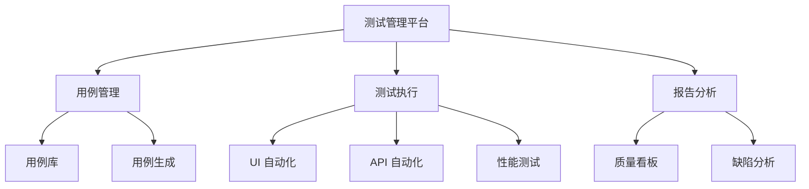

# 项目作品与技术成果

> 用代码解决问题 | 用数据证明价值 | 用成果说话

---

## 🏆 代表项目

### 项目一：企业级自动化测试平台（2020-2023）

**项目背景：**
- 公司产品线复杂，手动测试效率低
- 缺乏统一的测试管理和执行平台
- 测试覆盖率不足 30%，回归测试耗时 3 天

**我的角色：** 项目负责人 / 架构师

**技术方案：**

**技术栈：**
- 后端：Java + SpringBoot + MyBatis
- 前端：Vue.js + Element UI
- 测试：Selenium + Pytest + JMeter
- 数据库：MySQL + Redis
- 部署：Docker + Jenkins

**核心成果：**
| 指标 | 改进前 | 改进后 | 提升 |
|------|--------|--------|------|
| 测试覆盖率 | 30% | 85% | **+183%** |
| 回归测试时间 | 3 天 | 4 小时 | **-94%** |
| 缺陷发现率 | 基准 | +45% | **提升 45%** |
| 人力投入 | 10 人 | 3 人 | **-70%** |

**个人贡献：**
- 从 0 到 1 设计并实现平台架构
- 开发核心测试框架和工具库
- 建立质量度量体系和可视化看板
- 带领 5 人团队完成项目交付

**技术亮点：**
- ✅ 可扩展的插件化架构
- ✅ 支持 UI/API/性能测试一体化
- ✅ 智能测试用例推荐
- ✅ 实时质量监控和预警

---

### 项目二：AI 辅助测试用例生成系统（2024-2025）

**项目背景：**
- 测试用例编写耗时耗力
- 用例覆盖率依赖个人经验
- 需求变更导致用例维护成本高

**我的角色：** 技术负责人 / AI 应用探索者

**技术方案：**
- 基于大模型（LLM）的测试用例生成
- Prompt Engineering 优化生成质量
- RAG 知识库增强领域理解

**技术栈：**
- 大模型：ChatGPT, Claude, 文心一言
- 框架：LangChain, LlamaIndex
- 集成：Python + FastAPI
- 存储：Vector DB (Pinecone)

**核心成果：**
| 指标 | 数值 |
|------|------|
| 用例生成效率 | **提升 300%** |
| 用例覆盖率 | **提升 30%** |
| 维护成本 | **降低 50%** |
| 准确率 | **85%+** |

**个人贡献：**
- 设计 Prompt 模板和优化策略
- 开发测试用例生成 Agent
- 建立测试领域知识库
- 推动 AI 在团队的落地应用

**技术亮点：**
- ✅ 基于场景的智能用例生成
- ✅ 自动识别边界条件和异常场景
- ✅ 支持自然语言需求输入
- ✅ 持续学习和优化

---

### 项目三：质量度量与可视化看板（2022-2023）

**项目背景：**
- 质量数据分散，缺乏统一视图
- 管理层无法实时了解质量状态
- 质量问题发现和响应滞后

**我的角色：** 架构师 / 项目经理

**技术方案：**
- 多维度质量指标体系
- 实时数据采集和处理
- 可视化 dashboards

**技术栈：**
- 数据采集：Python + Kafka
- 数据处理：Flink + Spark
- 存储：Elasticsearch + MySQL
- 可视化：Grafana + 自研前端

**核心成果：**
| 指标 | 改进 |
|------|------|
| 质量透明度 | **提升 300%** |
| 问题响应时间 | **缩短 60%** |
| 决策效率 | **提升 50%** |

**个人贡献：**
- 设计质量度量指标体系
- 搭建实时数据处理流水线
- 开发多维度质量看板
- 建立质量预警机制

**技术亮点：**
- ✅ 实时质量监控
- ✅ 多维度数据分析
- ✅ 智能预警和推荐
- ✅ 支持自定义报表

---

## 🎮 实战项目（AI 协作开发）

### 项目四：PlantsGame 塔防游戏 MVP（2026.05）

**项目背景：**
- 探索 AI 协作开发的工程边界
- 验证 Claude Code 专家模式在完整项目中的实战能力
- 用 28 小时完成一个完整可玩的塔防游戏 MVP

**我的角色：** 独立开发者 / AI 协作探索者

**技术方案：**
- **AI 协作**：Claude Code 专家模式主导开发
- **游戏框架**：Phaser 3 + TypeScript
- **构建工具**：Vite
- **测试框架**：Vitest（54 个测试用例）
- **部署**：GitHub Actions → GitHub Pages
- **架构分层**：配置层 → 实体层 → 系统层 → 场景层

**核心成果：**
| 指标 | 数值 |
|------|------|
| 开发时间 | **28 小时** |
| 单元测试 | **54 个全通过** |
| 在线体验 | sunrong.site/plantsgame |
| 部署 | **GitHub Pages 自动部署** |

**个人贡献：**
- 全栈独立开发（架构 + 代码 + 测试 + 部署）
- 沉淀"先发散后收敛"等高效 AI 协作模式
- 输出《AI 协作复盘》博客（1000+ 阅读）
- 验证 AI 协作在完整项目中的可行性

**技术亮点：**
- ✅ AI 协作主导开发（Claude Code 专家模式）
- ✅ TDD 全程（54 个测试用例）
- ✅ 程序化纹理生成（Canvas API，零外部资源依赖）
- ✅ 清晰的分层架构（便于维护和扩展）
- ✅ CI/CD 自动化部署

---

## 📦 开源项目

### OpenClaw 个人 AI 助手

**项目描述：** 集成企业微信、待办、文档管理的 AI 助手框架

**技术栈：** TypeScript, Node.js, Enterprise WeChat API

**GitHub:** [github.com/openclaw/openclaw](https://github.com/openclaw/openclaw)

**核心功能：**
- ✅ 企业微信集成（通讯录、文档、待办）
- ✅ AI 对话和任务处理
- ✅ 定时任务和提醒
- ✅ 插件化扩展

**Star 数：** 100+

---

### 自动化测试工具集

**项目描述：** 内部开源的测试工具库，服务 50+ 项目

**技术栈：** Python, Java, Selenium, Pytest

**核心组件：**
- 测试框架封装
- 常用工具函数库
- 测试数据生成器
- 报告模板库

**使用规模：** 50+ 项目，100+ 开发者

---

## 📊 技术影响力

### 技术文章

| 平台 | 文章数 | 阅读量 | 链接 |
|------|--------|--------|------|
| **个人博客** | 89+ | 30,000+ | [sunrong.site](https://sunrong.site) |
| **知乎** | 10+ | 5,000+ | [@sunrong1](https://www.zhihu.com/people/sunrong1) |
| **内部技术论坛** | 20+ | 8,000+ | 华为内部 |

**精选文章（2026.6 最新）：**

**🏆 Agentic AICon 2026 系列**
- 《Agentic AICon 2026 完整战报：29 场演讲 + 6 篇博客 + π 型人才转型路径》
- 《AI 时代未来宣言：小红书 7 大金句 + π 型人才 + 个人 11 年转型路径》
- 《Tool Agent 范式：从 5 万工具 MCP 化看 AI 工业化的未来》

### 技术分享

- **华为内部技术分享**：5+ 场
  - 《测试架构设计实践》
  - 《AI 在测试中的应用》
  - 《质量度量体系建设》

- **技术沙龙讲师**：2 场
  - 上海测试技术沙龙
  - AI+ 测试实践分享

---

## 🎓 持续学习

### 2025-2026 学习重点

- 🤖 **AI 与大模型**
  - Prompt Engineering 深入
  - AI Agent 开发
  - RAG 技术应用

- 📊 **数据能力**
  - 数据分析与可视化
  - 实时数据处理
  - 质量度量方法

- 🏗️ **架构能力**
  - 微服务架构
  - 云原生技术
  - DDD 领域驱动设计

### 学习计划

| 领域 | 目标 | 进度 |
|------|------|------|
| AI 应用 | 掌握 Agent 开发 | 70% |
| 架构设计 | 系统架构师认证 | 50% |
| 英语能力 | 托业 900+ | 85% |

---

## 📬 技术交流

欢迎通过以下方式交流合作：

- **GitHub**: [@sunrong1](https://github.com/sunrong1)
- **邮箱**: sunrong1***@126.com
- **博客**: [sunrong.site](https://sunrong.site)
- **知乎**: [@sunrong1](https://www.zhihu.com/people/sunrong1)

---

**最后更新：** 2026-06-06  
**项目版本：** v2026.2

---

**🌿 用技术创造价值，用成果证明能力！**

[关于我](/intro.html) | [技术栈](/posts/career/tech-stack.html) | [技术文章](/posts/)

