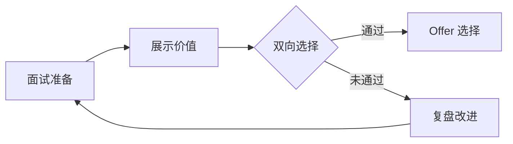

# 面试总结：11 年华为程序员的求职复盘

> 像奥特曼打怪兽一样准备面试，像收集宝可梦一样积累能力

---

## 📝 写在前面

2026 年，我在华为工作了 11 年，从初级工程师成长为测试开发架构师。最近开始看外部机会，面试了几家公司，有一些心得体会。

陪儿子看奥特曼和宝可梦时，我突然发现：**面试就像打怪兽，能力收集就像宝可梦图鉴**。这篇文章就是我的"打怪攻略"和"能力图鉴"。

---

## 🎯 第一部分：面试认知升级

### 面试的本质

面试不是"被审判"，而是**双向选择**和**价值展示**。



### 我的心态转变

| 阶段 | 心态 | 结果 |
|------|------|------|
| 11 年前 | 紧张、被动、怕被拒绝 | 表现不佳 |
| 现在 | 平等交流、展示价值 | 从容自信 |

**关键认知：** 面试是展示你能为公司创造什么价值，而不是证明你有多厉害。

---

## 📋 第二部分：面试准备清单

### 1️⃣ 自我认知（像选择宝可梦一样了解自己）

**我的能力图鉴：**

```
🔥 火系（技术硬实力）
├─ Java/SpringBoot ⭐⭐⭐⭐⭐ (11 年)
├─ Python ⭐⭐⭐⭐⭐ (8 年)
├─ 测试架构 ⭐⭐⭐⭐⭐ (11 年)
└─ AI 应用 ⭐⭐⭐⭐ (2 年)

💧 水系（管理能力）
├─ 团队管理 ⭐⭐⭐⭐ (2 年，10+ 人)
├─ 项目管理 ⭐⭐⭐⭐ (PMP)
└─ 绩效辅导 ⭐⭐⭐⭐

⚡ 电系（软技能）
├─ 沟通协调 ⭐⭐⭐⭐
├─ 向上管理 ⭐⭐⭐
└─ 战略规划 ⭐⭐⭐
```

**练习：** 列出你的能力雷达图，找出最强 3 项和最弱 3 项。

### 2️⃣ 目标公司研究（像研究怪兽弱点一样）

**研究清单：**

- [ ] 公司业务和商业模式
- [ ] 技术栈和技术挑战
- [ ] 团队规模和组织架构
- [ ] 面试流程和评价标准
- [ ] 薪资范围和福利政策

**信息来源：**
- 公司官网/公众号
- 脉脉/看准网
- LinkedIn/知乎
- 内推人脉

### 3️⃣ 简历优化（像打造宝可梦卡片一样）

**好简历的 5 个标准：**

1. **一页纸原则**：HR 平均只看 6 秒
2. **数据说话**：用成果证明能力
3. **针对性强**：根据 JD 调整内容
4. **简洁清晰**：无错别字，排版整洁
5. **突出卖点**：前 3 行抓住眼球

**案例对比：**

```markdown
❌ 差的描述
"负责自动化测试平台开发"

✅ 好的描述
"从 0 到 1 搭建自动化测试平台，服务 50+ 项目团队，
测试覆盖率从 30% 提升到 85%，回归测试时间从 3 天缩短到 4 小时"
```

---

## 💼 第三部分：面试实战经验

### 常见面试类型

| 类型 | 考察重点 | 准备策略 |
|------|----------|----------|
| **技术一面** | 基础功底、代码能力 | 刷题、复习基础、准备项目 |
| **技术二面** | 系统设计、架构能力 | 准备架构案例、设计思路 |
| **主管面** | 团队协作、文化匹配 | 了解团队、准备行为问题 |
| **HR 面** | 稳定性、薪资期望 | 了解市场、明确底线 |

### 高频问题及回答思路

#### 1. "请做个自我介绍"

**公式：** 现在 + 过去 + 未来

```
我现在是华为测试开发架构师，负责 XX 平台（现在）

过去 11 年，我从初级工程师成长为团队负责人，主导了 XX 项目，
取得了 XX 成果（过去）

现在希望寻找新的挑战和成长机会，贵公司的 XX 方向很吸引我（未来）
```

#### 2. "为什么考虑看机会"

**❌ 错误回答：**
- "在华为太累了"
- "领导不认可我"
- "薪资太低"

**✅ 正确回答：**
```
"在华为 11 年，我从初级工程师成长为架构师，非常感谢公司的培养。

现在希望寻找新的挑战，贵公司在 AI 测试方向的布局很吸引我，
我的自动化测试经验和 AI 应用能力可以很好地匹配这个岗位。

同时也希望能接触更多元的业务场景，实现更大的职业价值。"
```

#### 3. "你的优缺点是什么"

**优点（结合岗位需求）：**
```
"我的优势是技术深度和管理经验的结合：
- 11 年测试开发经验，从 0 到 1 搭建过多个平台
- 2 年团队管理经验，带领 10+ 人团队
- 持续学习能力强，最近在学习 AI 应用"
```

**缺点（真实但可改进）：**
```
"有时候对细节要求过高，可能导致进度压力。

改进方法：学会优先级排序，抓大放小，定期和团队对齐期望。"
```

#### 4. "你有什么问题想问我们"

**好问题示例：**
- "这个岗位的核心 KPI 是什么？"
- "团队目前面临的最大挑战是什么？"
- "公司对这个岗位的期望是什么？"
- "团队的技术栈和开发流程是怎样的？"

**避免问：**
- "加班多吗？"（可以换种方式问）
- "薪资能給多少？"（等 HR 面再谈）

---

## 🎮 第四部分：能力收集指南（宝可梦图鉴版）

### 能力分类

#### 🔥 技术能力（必须收集的核心宝可梦）

| 能力 | 重要性 | 如何提升 |
|------|--------|----------|
| 编程语言 | ⭐⭐⭐⭐⭐ | 做项目、刷题、写博客 |
| 系统设计 | ⭐⭐⭐⭐⭐ | 参与架构设计、学习案例 |
| 问题解决 | ⭐⭐⭐⭐⭐ | 主动承担难题、复盘总结 |
| AI 应用 | ⭐⭐⭐⭐ | 学习课程、实战项目 |

#### 💧 管理能力（进化后的形态）

| 能力 | 重要性 | 如何提升 |
|------|--------|----------|
| 团队管理 | ⭐⭐⭐⭐ | 带项目、学习管理课程 |
| 向上管理 | ⭐⭐⭐⭐ | 主动沟通、争取资源 |
| 绩效管理 | ⭐⭐⭐ | 学习绩效辅导方法 |
| 人才培养 | ⭐⭐⭐ | 指导新人、分享经验 |

#### ⚡ 软技能（隐藏技能）

- **沟通能力**：清晰表达、倾听理解
- **学习能力**：快速掌握新知识
- **抗压能力**：在压力下保持效率
- **时间管理**：Time Boxing 方法

---

## 📊 第五部分：面试复盘模板

### 每次面试后记录

```markdown
## 面试复盘 - [公司名] - [日期]

### 基本信息
- 岗位：
- 轮次：
- 面试官：
- 时长：

### 问题记录
1. 问题 1：
   - 我的回答：
   - 更好的回答：

2. 问题 2：
   ...

### 表现评估
- 发挥好的地方：
- 需要改进的地方：

### 学习收获
- 新学到的知识点：
- 对行业的新认知：

### 下一步行动
- [ ] 复习 XX 知识点
- [ ] 准备 XX 案例
- [ ] 练习 XX 问题
```

---

## 🚀 第六部分：3 个月面试计划

### 第 1 个月：准备期

**目标：** 完成所有准备工作

- [ ] 更新简历（迭代 3 版）
- [ ] 梳理项目案例（5-8 个）
- [ ] 复习技术基础（数据结构、算法、系统设计）
- [ ] 了解目标公司（10-20 家）
- [ ] 模拟面试（3-5 次）

### 第 2 个月：实战期

**目标：** 密集面试，收集反馈

- [ ] 每周面试 2-3 家
- [ ] 每次面试后复盘
- [ ] 根据反馈调整策略
- [ ] 建立面试题库

### 第 3 个月：冲刺期

**目标：** 拿到理想 Offer

- [ ] 聚焦目标公司
- [ ] 针对性准备
- [ ] 薪资谈判
- [ ] Offer 选择

---

## 💡 第七部分：给求职者的建议

### 心态建议

1. **保持平常心**：面试是双向选择，不是单向审判
2. **接受失败**：被拒是常态，每次都是学习机会
3. **持续学习**：即使不面试，也要保持成长
4. **建立自信**：相信自己的价值和能力

### 实战建议

1. **不要裸辞**：在职找工作更有底气
2. **多渠道投递**：内推 > 猎头 > 招聘网站
3. **记录过程**：建立面试追踪表
4. **维护人脉**：和前同事、同行保持联系

### 避坑指南

**❌ 避免：**
- 海投简历，没有针对性
- 面试前不做准备
- 抱怨前公司/领导
- 只谈薪资，不谈价值
- 面试后不复盘

**✅ 建议：**
- 精选 10-20 家目标公司
- 每家都做充分调研
- 强调你能创造的价值
- 每次面试都复盘改进
- 保持学习和成长

---

## 🌟 写在最后

面试是一场修行，既是能力的检验，也是心态的磨练。

**像奥特曼一样：** 每一次被打倒，都要站起来，变得更强。

**像宝可梦训练师一样：** 持续收集能力，打造你的最强阵容。

**最后送给大家一句话：**

> 机会总是留给有准备的人。今天的准备，就是明天的 Offer。

---

## 📚 参考资源

### 书籍推荐
- 《程序员面试宝典》
- 《金领简历：敲开阿里、腾讯、谷歌的大门》
- 《向上管理：如何正确汇报工作》

### 在线课程
- 极客时间《面试大课》
- 拉勾教育《Java 架构师面试》

### 工具推荐
- 简历模板：Canva、超级简历
- 面试追踪：Notion、飞书多维表格
- 刷题平台：LeetCode、牛客网

---

**最后更新：** 2026-03-21  
**本文字数：** 约 4000 字  
**阅读时间：** 大约 15 分钟

---

<div align="center">

**🌿 保持学习，保持热爱，一起成长！**

[返回首页](/) | [查看文章](/posts/) | [技术文档](/docs/)

</div>


---

欢迎交流讨论，我的 blog：[sunrong.site](https://sunrong.site)
